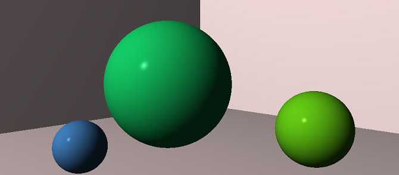

# Rust Raytracer

💡 A **WIP** test-driven raytracer built in Rust.

Uses rayon for data parallelism and Criterion for benchmarking.

## Run

`cargo run --release --bin X` where X is the binary you wish to run.

The binaries output a ppm file to an "output" directory which you need to make.

## Test

`cargo test`

## Benchmark

`cargo bench X` where X is the benchmark you wish to run.

---

_Based on the book "The Ray Tracer Challenge"._
